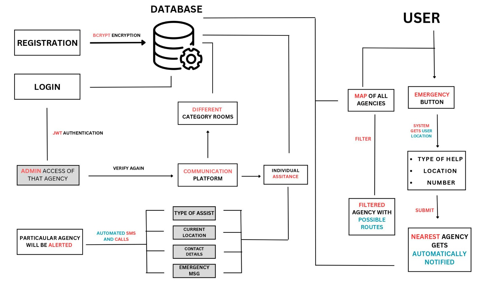

# Disaster Management and Coordination Application

## Overview

The **Disaster Management and Coordination** web-application emerges as a crucial tool in the realm of crisis response, providing a centralized platform for rescue agencies to seamlessly register, communicate, and collaborate during natural or man-made calamities. This multifaceted system aims to revolutionize disaster management by offering an array of essential features that foster efficient coordination and communication among stakeholders.

## Key Features

### 1. Agency Registration and Login

The foundation of the application lies in its **Agency Registration and Login** feature. This component allows rescue agencies to register effortlessly, ensuring their essential information is securely stored. The registration process involves providing key details such as name, contact number, email, address, description, category, and location. Password-protected accounts, implementing secure practices like bcrypt for password hashing and JWT authentication, guarantee data privacy and restrict access to authorized users only.

### 2. Enhanced Emergency Alert System

#### User Emergency Button

During emergencies, the **Enhanced Emergency Alert System** becomes the lifeline for users. A simple click on the User Emergency Button triggers an immediate response from the nearest and most relevant rescue agency. This system is finely tuned to categorize emergencies, ensuring that the right agency is notified promptly.

#### Automated Phone Call and SMS Alerts

The application supplements digital alerts with **Automated Phone Call Alerts** and **Automated SMS Alerts**. In the event of an emergency, the system automatically dials the appropriate agency, delivering critical information and instructions in real-time. This comprehensive approach, combining automated phone calls, SMS alerts, and precise categorization, ensures that agencies receive vital information through multiple channels, significantly enhancing their ability to respond swiftly and efficiently.

### 3. View Locations of All Agencies

Navigating through the application, users can access a map-based feature that visualizes the geographical locations of all registered rescue agencies. The **View Locations of All Agencies** feature utilizes map markers for at-a-glance access to agency details and contact information. Users can filter agencies based on categories, facilitating efficient allocation of resources during emergencies. Integrated navigation directions offer swift routes to agency locations, ensuring a timely response.

### 4. Agencies Communication Room

At the heart of the application lies the **Agencies Communication Room**, where rescue agencies converge for real-time collaboration. This dynamic space includes a chat room equipped with real-time chat functionality, discussion boards for in-depth conversations This feature fosters effective coordination among agencies, enhancing disaster response efforts.

### 5. Government Department Registration

Recognizing the importance of collaboration, the application extends an invitation to government departments through the **Government Department Registration** feature. By joining the network of actively involved agencies in disaster management, government entities can contribute their expertise and resources, thereby strengthening the collective response to crises.

## Security and Privacy Considerations

Building an application of this nature requires meticulous attention to **security and privacy**. Measures such as password hashing using bcrypt and JWT authentication are implemented to secure user accounts. Access to the central database is restricted to authorized users, ensuring that sensitive information like personal contact details is protected.

## Conclusion

In conclusion, the Disaster Management and Coordination Application emerges as a robust solution to the challenges posed by natural or man-made disasters. By facilitating efficient agency registration, providing an enhanced emergency alert system, offering a visual representation of agency locations, fostering real-time communication and collaboration, and incorporating government departments, this application creates a comprehensive ecosystem for effective disaster management. The emphasis on security and privacy ensures that the application serves as a reliable and trusted tool for rescue agencies, contributing significantly to coordinated and timely responses during crises.

# Tech Stacks Used

## Frontend

### React.js
React.js is the primary frontend library used for building user interfaces. Its component-based architecture enables modular and efficient development of the application's frontend.

### Socket.io
Socket.io is utilized for real-time communication between the server and the frontend. This technology facilitates instant updates and seamless collaboration within the Agencies Communication Room.

### Chakra UI
Chakra UI is chosen as the frontend framework for its component library and ease of customization. It streamlines the UI development process, ensuring a consistent and visually appealing user interface.

### Maps
- **Leaflet**: Leaflet is employed for creating interactive maps within the application. Its lightweight nature and simplicity make it an ideal choice for visualizing the geographical locations of registered rescue agencies.
- **Google Maps**: Google Maps integration is used to enhance mapping capabilities and provide users with accurate navigation directions.

## Backend

### Node.js
Node.js serves as the runtime for the backend, offering a scalable and non-blocking architecture. Its efficiency in handling concurrent connections is crucial for real-time features and overall system responsiveness.

### Express.js
Express.js is employed as the backend web framework, simplifying the process of building robust and scalable web applications. Its middleware architecture enhances the handling of HTTP requests and responses.

### Socket.io – Server
Socket.io is utilized on the server side for real-time bidirectional event-based communication. This is essential for instant updates and communication within the application.

### Mongoose
Mongoose is the Object Data Modeling (ODM) library used for MongoDB and Node.js. It streamlines database operations, providing a straightforward and structured way to interact with the MongoDB database.

### Jwt, bcrypt.js
JsonWebToken (JWT) is employed for secure user authentication, and bcrypt.js handles password hashing for enhanced security measures. These technologies contribute to the robust security infrastructure of the application.

### Twilio API
The Twilio API is integrated for automated phone call alerts. This API allows for seamless communication with rescue agencies through automated phone calls, enhancing the emergency alert system.

## Database

### MongoDB
MongoDB, a NoSQL database, is chosen for its scalability and flexibility. It stores essential information about rescue agencies, users, and other pertinent data in a structured manner.

